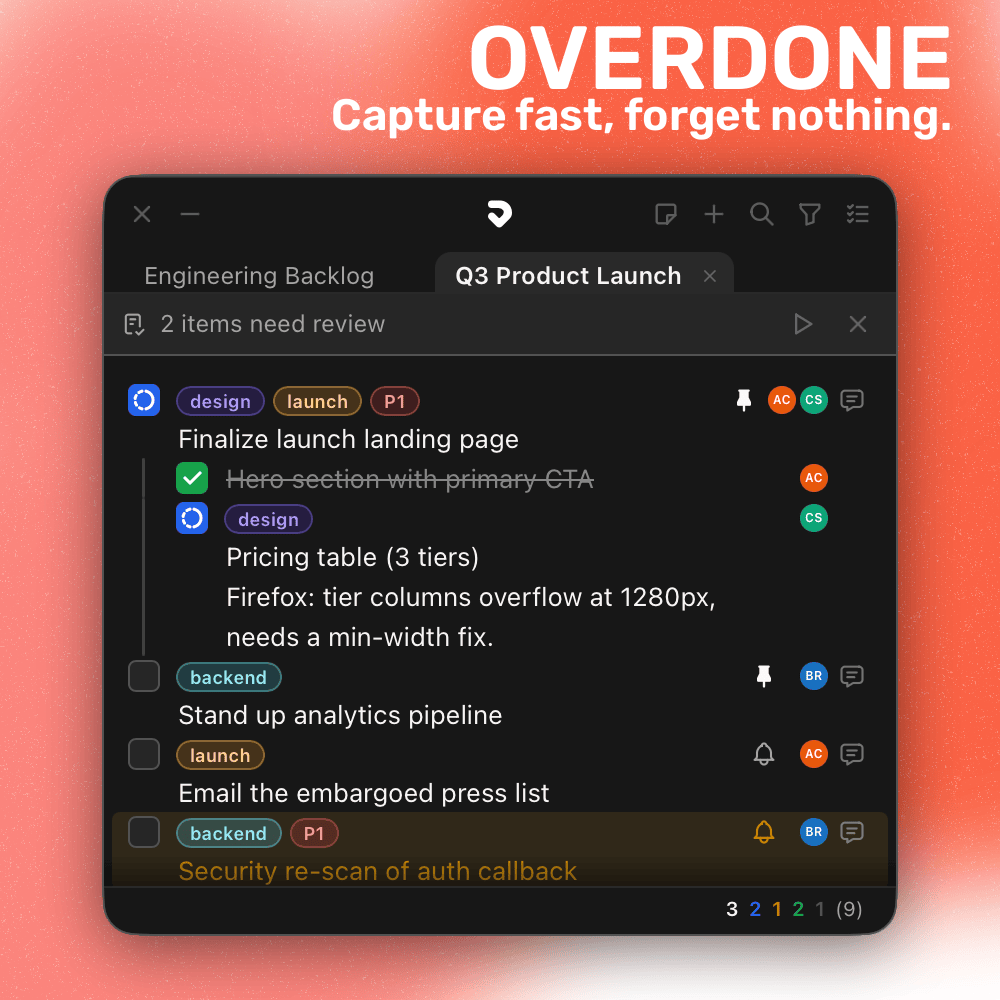
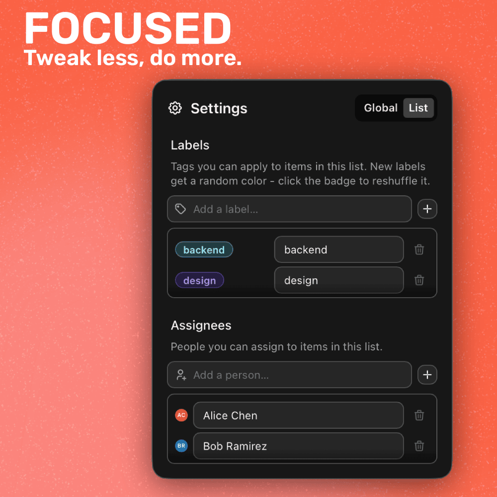
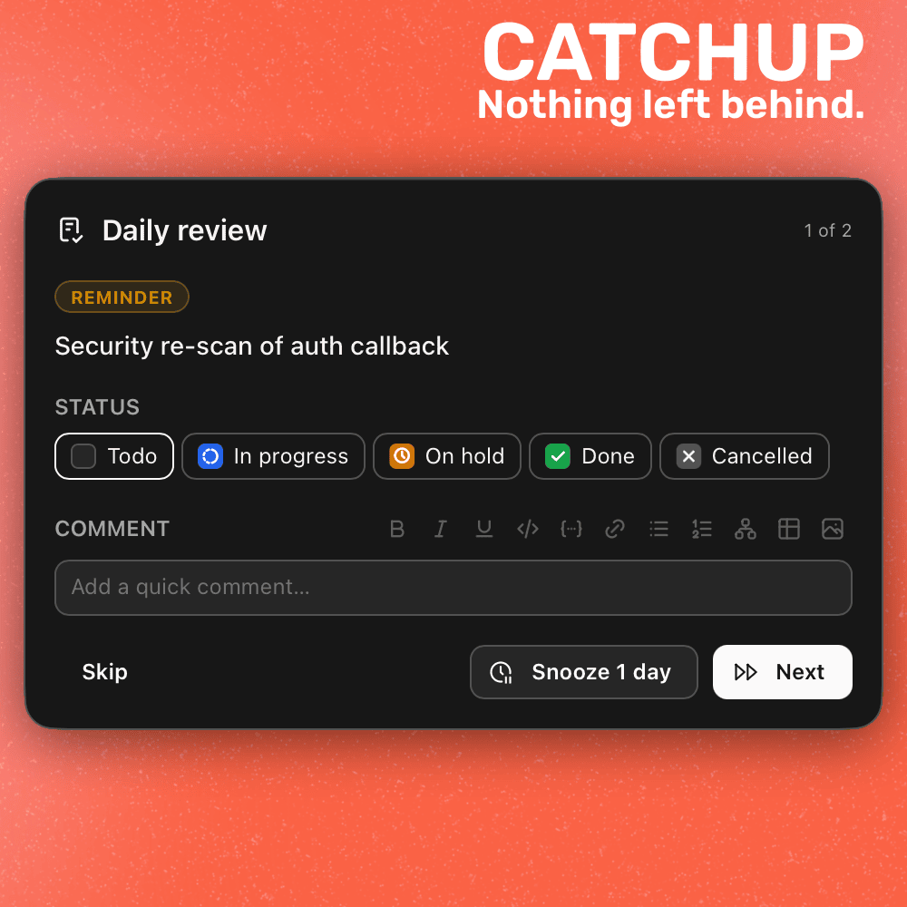
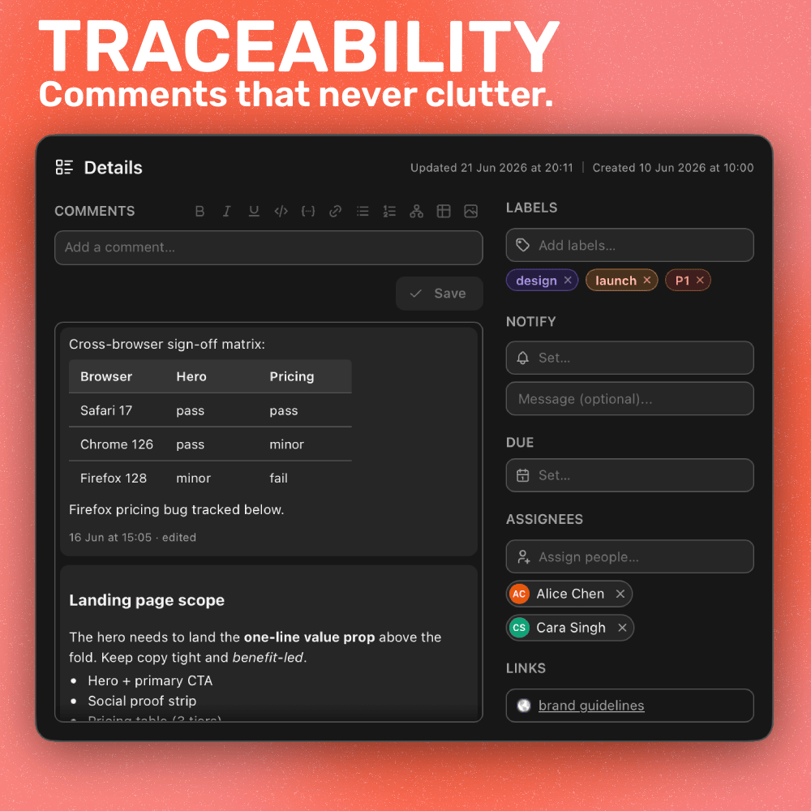
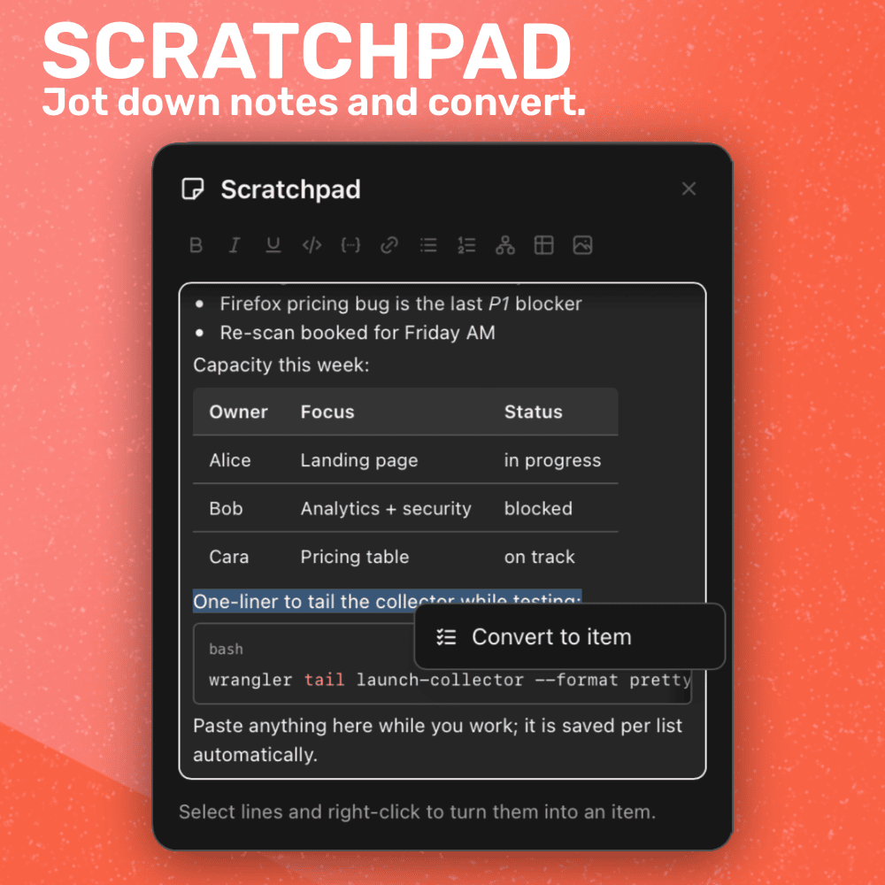
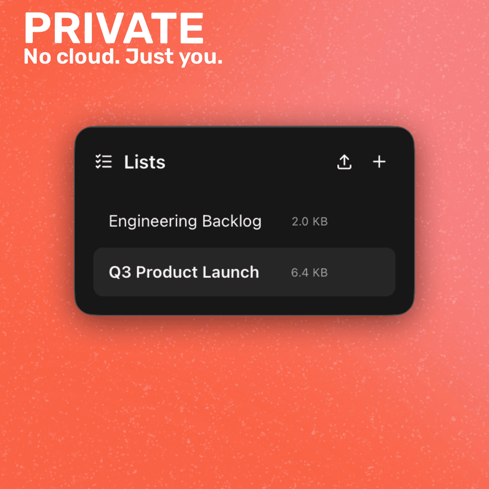

	

<h1 align="center">Overdone</h1>

	
    
    
    

 

	Capture tasks as fast as you can type, and let the daily review catch whatever's <i>overdue</i>.

 

	

 

Notion, Jira, Trello, even Todoist and Things: they're all _overdone_. They want projects, onboarding, and setup before you can write down a single thought, and keeping them tidy becomes its own chore. Overdone goes the other way. It's the notebook that grew up, as quick to jot in as a sticky note and as capable as you need when a task actually earns it. Click it, start typing, that's it.

It floats above whatever you're working on, so capturing something never means switching context. It's local and private by design, just you and your work with no team looking over your shoulder. And it's dogfooded, built by someone who lives in it every day, so the rough edges get filed down because they got in my way too.

 

<b>Table of Contents</b>

- [Install](#-install)
- [Stay On Top Of Everything](#️-stay-on-top-of-everything)
  - [Type To Capture](#type-to-capture)
  - [Daily Review](#daily-review)
  - [Rich Comments](#rich-comments)
  - [Scratchpad](#scratchpad)
  - [Built To Float](#built-to-float)
  - [Lists, Search & Filter](#lists-search--filter)
  - [Entirely Local](#entirely-local)
- [Source & License](#-source--license)

 

# 🤝 Install

Grab the installer from Payhip. One payment helps support continued development, and every future update is included.

	<a href="https://store.overpolish.co/b/9MNp8"><b>Buy on Payhip →</b></a>

 
 

Prefer to build Overdone yourself rather than pay for the installer? You can. Clone the repo and follow [CONTRIBUTING.md](./CONTRIBUTING.md). The source is [PolyForm Noncommercial](./LICENSE), so self-built use is for personal projects only. Paying gets you a signed installer with a [commercial-use license](./COMMERCIAL-LICENSE.md) for paid client work, plus all future updates.

 

# ⚡️ Stay On Top Of Everything

## Type To Capture

Start typing anywhere and a new item appears at the top of the list. No buttons, no dialogs. The same line understands what you mean: `#label` tags it, `@name` (or `assign to name`) assigns it, `due friday` sets a deadline, and `remind me tomorrow 3pm` schedules a notification. Labels and assignees are fuzzy-matched against your list as you type, so capturing a fully-tagged task never breaks your flow.

Items move through five states (Todo, In Progress, On Hold, Done, Cancelled) and nest one level deep for sub-tasks. Everything is keyboard-driven, with full undo/redo that coalesces consecutive edits into single steps. Only labels and assignees are yours to customize; everything else is set, so you spend your time doing instead of tweaking.

	

## Daily Review

The whole point of the name. Overdone surfaces what slipped. A daily catch-up stack gathers everything that's overdue, due today, or quietly gone stale, then walks you through it card by card.

	

## Rich Comments

Every item carries a timestamped comment log with proper rich text, not just a notes field. Paste or drag in images and videos, and embed Mermaid diagrams that render inline with click-to-expand. Attachments can stay original or auto-compress to keep lists light.

Because the log is kept in full, months later it still tells you why a task exists and what happened to it. That's the context most todo apps throw away the moment you tick a box.

	

## Scratchpad

Not everything starts as a task. The scratchpad is a freeform notes pad in its own window that floats beside your work, so you can dump a thought, a meeting's worth of notes, or a half-formed idea without forcing it into a list first. It's the same editor as comments, so tables, code blocks, images, and diagrams all render inline, and every keystroke saves as you go. Each list keeps its own pad.

When a note earns its place as a task, select the lines, right-click, and convert: the first line becomes the item and everything after it, extra lines and any images included, lands as its first comment. The scratchpad clears the part you promoted.

	

## Built To Float

Overdone is made to sit alongside whatever you're working on. Keep the window always on top, click straight through it with passthrough mode, and exclude it from screen capture so it never shows up in Zoom, Teams, or a recording. A tray icon keeps it one click away and turns red the moment a reminder needs action.

## Lists, Search & Filter

Split work across as many lists as you like and switch between them instantly. Fuzzy search reaches into everything, comment text and labels included, and filters narrow the list down to whatever you're after. Save the combinations you reach for as presets, and export any list to Markdown to share or back up.

## Entirely Local

Everything lives on your machine. No account, no sign-in, no cloud sync, no telemetry. Your lists, comments, and attachments are plain files you own. The app only reaches the network to check for updates and fetch favicons for links; your tasks never leave your computer unless you export them yourself.

This is built for one person: you. There's no shared workspace and nothing to maintain for anyone else's benefit. Just your work.

	

 

# 📜 Source & License

Overdone is dual-licensed:

- **Source code:** [PolyForm Noncommercial 1.0.0](./LICENSE) enabling you to read it, learn from it, and build it for personal use.
- **Paid installer (Payhip):** [Commercial-use license](./COMMERCIAL-LICENSE.md) granted to the named purchaser. One person, non-transferable, all current and future updates included.
